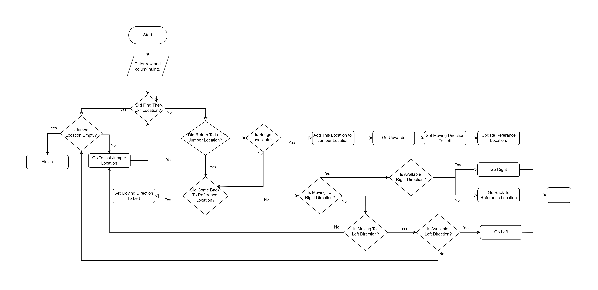

<h1><i>PathFinder-2</i> </h1>

<h2>Content</h2>
<ul>
        <li><a href="#about-project">1-) About The Project</a></li>
        <li><a href="#why-project-created">2-) Why The Project Is Created</a></li>
        <li><a href="#used-technologies">3-) Used Technologies </a></li>
        <li><a href="#images">4-) Images </a>
                <ul> 
                        <li><a href="#gif">I-) GIF</a></li>
                        <li><a href="#netbeans-output">II-) Netbeans Output</a></li>
                        <li><a href="#windows-cmd-output">III-) Windows Cmd Output</a></li>
                </ul>
        </li>
        <li><a href="#video-links"> 5-) Video Links</a></li>
        <li><a href="#workflow">6-) Workflow</a></li>
        <li><a href="#requirement">7-) Requirements</a></li>
        <li><a href="#quick-start">8-) Quick Start</a></li>
        <li><a href="#how-to-run-in-netbeans">9-) How To Run In Netbeans?</a></li>
        
</ul>

<h2 id="about-project">About The Project</h2>
This project is the second version of the project <a href="https://github.com/AhmetEminSaglik/PathFinder-1"><i>PathFinder-1</i></a>. This version generates a lot of bridges. And then finds all paths from the start location to the exit location. Then sort them from shortest to longest steps. The main purpose of the project is to show the shortest way.
<br>

<h2 id="why-project-created"> Why the project is created</h2>
The project was created to improve algorithm skills in 2019 (first year at University). 

<h2 id="used-technologies">3-) Used Technologies</h2>

* Java SE
* Netbeans

<h2 id="images">4-) Images </h2>

<ul> 
        <li>
<h3 id="gif">I-) GIF</h3>


        <br><br></li>
        <li>
<h3 id="netbeans-output">II-) Netbeans Output </h3>


        <br><br></li>
        <li>
<h3 id="windows-cmd-output">III-) Windows Cmd Output </h3>


       </li>
        
</ul>
<!-- 
<h2>GIF</h2>

<h2> Netbeans Output</h2>

<h2> Windows </h2>
 -->

<br>
<h2 id="video-links">5-) Video Links</h2>

* <a href="https://www.youtube.com/watch?v=BNGwhRaB7dY"> Youtube Link </a>
* <a href="https://www.linkedin.com/posts/ahmeteminsaglik_java-algorithm-algorithms-activity-7065611128730529792-801X/?utm_source=share&utm_medium=member_desktop"> Linkedin Link </a>

<br>


<h2 id="workflow">6-) Workflow</h2>
The flowchart below provides a brief overview of the program.
<br><br>



<h2 id="requirement">7-) Requirements</h2>

The project can run `JDK 1.8+`

<h2 id="quick-start">8-) Quick Start</h2>

1-) Copy and paste the following command in your cmd. 
```
git clone https://github.com/AhmetEminSaglik/PathFinder-2.git
```
3-) Then copy and paste the following command in your cmd. 
```
 java -jar  PathFinder-2/dist/AES_Robot_2.jar
```

<h2 id="how-to-run-in-netbeans">9-) How To Run In Netbeans?</h2>

1-) Install these :
<br>
* <a href="https://www.oracle.com/java/technologies/downloads/#java8">Java SE Development Kit 8 (JDK 8)</a>
* After installing JDK 8, install one of the following IDE :
<ul><ul>
        <li> <a href="https://netbeans.apache.org/front/main/download/index.html">NetBeans IDE</a></li>
        <li> <a href="https://www.jetbrains.com/idea/download/?section=windows"> Intelij IDEA (Community Edition) </a></li>
</ul></ul>

2-) Copy and paste the following command in your cmd. 
```
git clone https://github.com/AhmetEminSaglik/PathFinder-2.git
```
3-) Open IDE, and open the cloned project.

4-) The project is ready to run.
