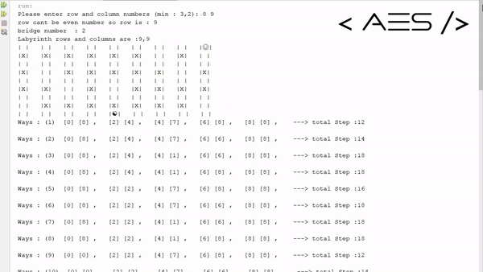
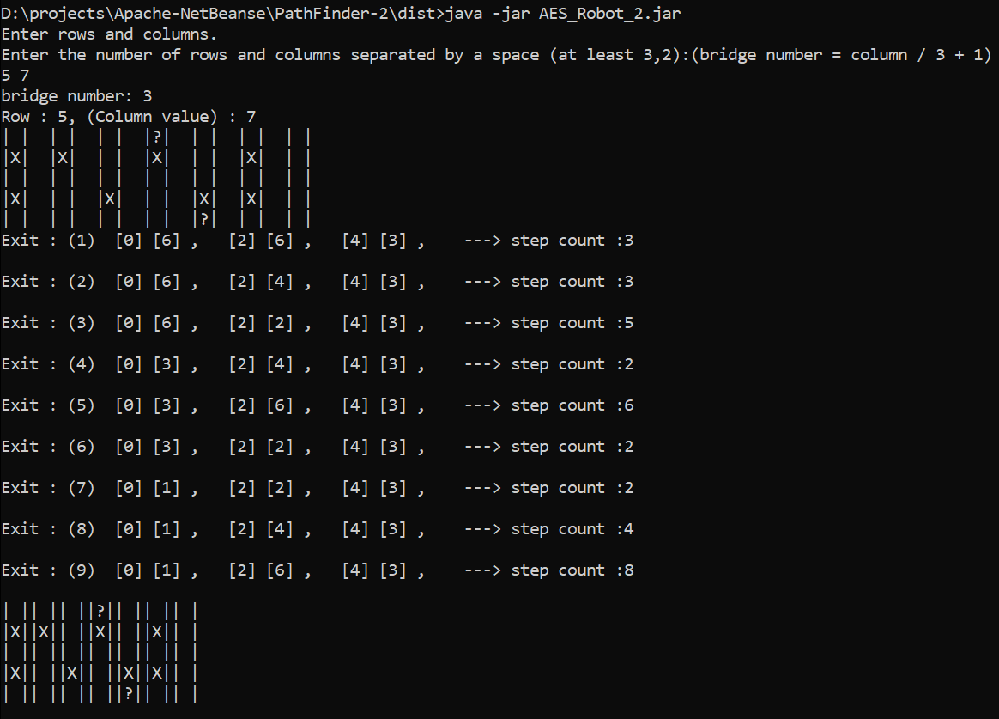
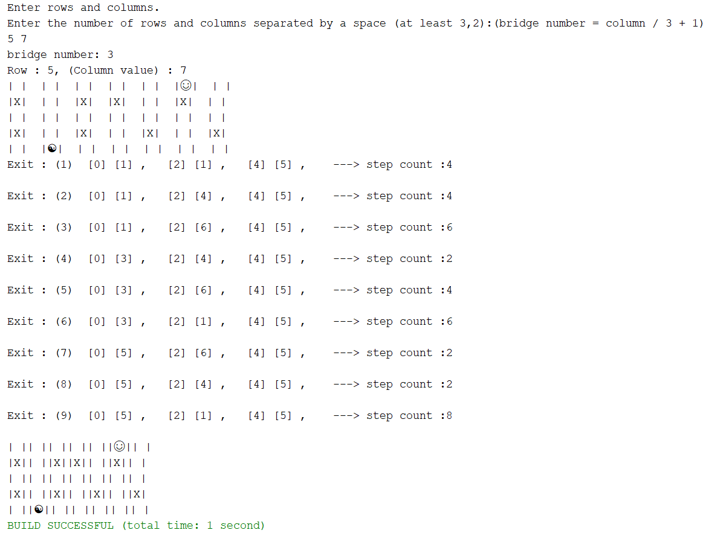

<h1><i>PathFinder-1</i> </h1>
<h2>GIF</h2>


<!-- -->

<h2> Netbeans Output</h2>


<h2> Windows </h2>


<br>
<h2>Video Links</h2>

* <a href="https://www.youtube.com/watch?v=Ry_n_0eYv3Y"> Youtube Link </a>
* <a href="https://www.linkedin.com/posts/ahmeteminsaglik_java-algorithm-algorithms-activity-7064986513301749761-bvRb/?utm_source=share&utm_medium=member_desktop"> Linkedin Link </a>

<br>
<h2>Introduction</h2>
The project aims to generate a random maze with a correct path from the start location to the exit location. This maze includes random bridges that allow the car/robot to move to the upper row in the maze. The car/robot has a random start location in the maze's lowest row, and its purpose is to move along the correct path to reach the exit.
<br>

<h2>How Does Work?</h2><br>
The car/robot follows these steps : 
<br><br>
1-) If bridge is available go upwards <br>
2-) Else, if moving in the right direction and there is an available square, proceed in the right direction<br>
3-) Else, move towards the reference point.<br>
4-) Go left.
<br><br>
Here is a basic code these steps to understand better :
<br><br>

        if (bridge.isAvaiable) {
            goUp();
        } else if (car.direction = Direction.RIGHT && rightPath.isAvailable()) {
            goRight();
        } else if (goingRight() && rightPath.isAvailable() == false) {
            goReferanceLocation();
            car.setDirection(Direction.LEFT);
        } else {
            goLeft();
        }
        
<h2> Why the project is created</h2>
The project was created to improve algorithm skills in 2019 (first year at University). 

<h2>Requirements</h2>

The project can run `JDK 1.8+`

<h2>How to Run</h2>

1-) Install these :
<br>
* <a href="https://www.oracle.com/java/technologies/downloads/#java8">Java SE Development Kit 8 (JDK 8)</a>
* After installing JDK 8, install <a href="https://netbeans.apache.org/front/main/download/index.html">NetBeans IDE</a>

2-) Copy and paste following command in your cmd. 
```
git clone https://github.com/AhmetEminSaglik/PathFinder-1.git
```

3-) Open Netbeans and open the project where did you clone.

4-) Project is ready to run.
